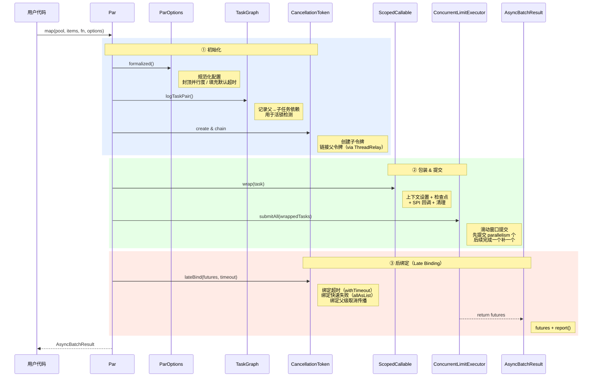

**中文** | [**English**](README_EN.md)

# 🪿 VFormation（雁阵）

> **⚠️ 项目状态：开发中（Pre-release）**
>
> 本项目仍在积极开发中，API 可能会发生变化。欢迎通过 Issue 提交反馈和建议。

## 项目介绍

如果说 Java 21 的虚拟线程（Virtual Threads）拉开了 Java 并发模型变革的序幕，那么 Java 26 即将发布的结构化并发（Structured Concurrency）无疑标志着 Java 并发编程进入了"结构化时代"。然而，现实是残酷的——绝大多数企业生产系统仍然运行在 Java 8 上，这些系统距离享受结构化并发的红利还有漫长的升级之路。与此同时，开发者在 Java 8 上编写并行代码时，依然面临着取消信号丢失、上下文无法传播、线程池死锁难以诊断等棘手问题，却缺少一个系统性的解决方案。为此，我们发起了 **VFormation（雁阵）** 项目，希望将结构化并发的核心思想——协作式取消、快速失败、上下文传播——带回 Java 8 生态。

正如大雁以 V 字阵型协作飞行、分担阻力，VFormation 通过**协作式取消、快速失败、死锁检测、上下文传播和滑动窗口调度**来编排你的并行任务。如今 Java 并发框架主要分为两派：一派是 CompletableFuture 链式编排，本质是响应式流水线，擅长异步编排但缺少结构化语义；另一派则是 ExecutorService + invokeAll 的传统模型，简单直接但缺乏取消传播和失败隔离能力。VFormation 旨在走出第三条路——**以结构化并发为内核，以 Guava ListenableFuture 为基石**，在不升级 JDK 的前提下，让你的并行代码具备**失败即止、取消级联、死锁可见**的工程级保障。我们相信，好的并发框架不应该只是一组 API，而应该是一套安全网——让开发者专注于业务逻辑，把并发的复杂性交给框架去兜底。希望 VFormation 能成为你在 Java 8 并发世界中的可靠伙伴，从"能跑就行"走向"结构化、可观测、可诊断"的并发编程实践。

---

## 快速开始

大多数场景下，你只需要用 **`Par.map`** 一个方法：

### 1. 添加 Maven 依赖

```xml
<dependency>
    <groupId>io.github.huatalk</groupId>
    <artifactId>vformation</artifactId>
    <version>1.0.0</version>
</dependency>
```

### 2. 初始化（应用启动时执行一次）

```java
ParConfig config = ParConfig.builder()
    .executor("io-pool", Executors.newFixedThreadPool(10))
    .build();
Par par = new Par(config);
```

### 3. 使用 `Par.map` 并行处理

```java
ParOptions options = ParOptions.ioTask("fetchData")
    .parallelism(5)
    .timeout(3000)
    .build();

List<String> urls = Arrays.asList("url1", "url2", "url3", "url4", "url5");
AsyncBatchResult<String> result = par.map(
    "io-pool",
    urls,
    url -> httpClient.fetch(url),
    options
);

List<ListenableFuture<String>> futures = result.getResults();
```

以上就是全部。`Par.map` 内部自动处理滑动窗口调度、超时控制、快速失败取消和上下文传播，无需额外配置。

---

## 核心特性

### ⚡ 快速失败（Fail-Fast）

**问题：** 传统并行处理中，某个子任务失败后其余任务仍继续执行，白白消耗线程和 IO 资源，调用方还得等所有任务结束才能拿到错误。

**方案：** 任一子任务抛出异常，框架立即取消同批所有剩余任务。这是刻意的设计选择——只提供 fail-fast 语义，不提供"忽略失败继续执行"模式。如需容错，在任务函数内部自行 catch。

### 🛡️ 协作式取消（Cooperative Cancellation）

**问题：** `Thread.interrupt()` 对不检查中断标志的代码无效，强制 kill 线程可能导致资源泄漏。嵌套并行调用时，取消信号无法自动向下传播。

**方案：** 父子令牌自动级联，取消父任务即级联取消所有子任务。Late-Binding 机制在所有任务提交后才绑定超时和 fail-fast，避免竞态。双异常策略——`LeanCancellationException`（无堆栈，零开销）用于高频场景，`FatCancellationException`（完整堆栈）用于调试。

### 🔗 上下文传播（Context Propagation）

**问题：** `ThreadLocal` 值在任务提交到线程池后丢失，请求级上下文（链路追踪 ID、用户身份、取消令牌）无法自动传递到子线程，开发者被迫在每个任务中手动传参。

**方案：** 基于 Alibaba TTL 的两级 Map 接力——父线程的 `curMap` 自动成为子线程的 `parentMap`，取消令牌、任务配置、任务名称透明传播，零侵入业务代码。

### 🚀 滑动窗口调度（Sliding-Window Scheduling）

**问题：** 一次性提交所有任务到线程池，任务量大时造成内存压力和线程饥饿；`invokeAll()` 阻塞到全部完成，无法逐个获取结果。

**方案：** "完成一个补一个"的滑动窗口——初始提交 parallelism 个任务，每完成一个立即补充一个，既保持线程池满载又避免溢出。

### 🔌 可插拔扩展（Pluggable SPI）

**问题：** 硬编码的监控和扩展点难以适配不同技术栈，框架与业务监控系统耦合。

**方案：** 三个 SPI 扩展点注册在 `ParConfig` 上，零硬编码依赖：
- **TaskListener** — 任务生命周期回调（耗时、排队时间、异常），对接任意监控系统
- **ExecutorResolver** — 线程池名称解析，支持 purge 清理和死锁检测
- **LivelockListener** — 死锁检测事件回调

### 🔍 死锁检测（Deadlock Detection）

**问题：** 嵌套并行调用共享同一线程池时，外层任务占住线程等待内层完成，内层排队等外层释放线程——死锁。此类问题在生产环境极难复现和定位。

**方案：** 请求级 DAG 图自动记录任务依赖关系，请求结束时执行环路检测，覆盖任务级循环依赖和执行器级自环，通过 SPI 回调通知诊断结果。

### 🎯 任务类型感知调度（Task-Type-Aware Dispatch）

**问题：** CPU 密集型和 IO 密集型任务混用同一队列，大量 IO 任务排队会饿死 CPU 任务，计算延迟飙升。

**方案：** CPU 密集型任务的 `offer()` 返回 `false`，触发拒绝策略（通常 `CallerRunsPolicy`），宁可调用方线程同步执行也不阻塞工作线程；IO 密集型正常排队。

---

## 进阶功能

以下功能按需启用，不影响 `Par.map` 的基本使用。

### 协作式取消

```java
// 父任务中
CancellationToken parentToken = CancellationToken.create();
CancellationToken childToken = new CancellationToken(parentToken);

// 取消父任务 → 自动级联到子任务
parentToken.cancel(false);
// childToken 状态也会变为 PROPAGATING_CANCELED

// 在子任务代码中设置检查点
Checkpoints.checkpoint("myTask", true);  // 如果已取消，抛出 LeanCancellationException
```

### 注册监控回调

```java
ParConfig config = ParConfig.builder()
    .executor("io-pool", Executors.newFixedThreadPool(10))
    .taskListener(event -> {
        System.out.printf("Task [%s] completed in %dms (waited %dms in queue)%n",
            event.getTaskName(),
            event.executionTimeMillis(),
            event.waitTimeMillis());

        if (event.getException() != null) {
            System.err.println("Task failed: " + event.getException().getMessage());
        }
    })
    .build();
```

### 死锁检测

```java
// 通过 Builder 构建包含死锁检测的配置
ParConfig config = ParConfig.builder()
    .executor("shared-pool", pool)
    .livelockDetectionEnabled(true)
    .livelockListener(event -> {
        if (event.hasExecutorSelfLoop()) {
            log.warn("Potential deadlock: executor self-loop detected! {}",
                event.getExecutorEdges());
        }
    })
    .executorResolver(new ExecutorResolver() {
        @Override
        public ThreadPoolExecutor resolveThreadPool(String name) {
            return executorMap.get(name);
        }

        @Override
        public Map<String, String> getTaskToExecutorMapping() {
            return taskToPoolMapping;  // e.g., {"fetchPrice": "io-pool", "calculate": "cpu-pool"}
        }
    })
    .build();

// 在请求入口初始化
TaskGraph.initOnRequest();
try {
    // ... 执行业务逻辑，期间所有 Par 调用会自动记录依赖关系
} finally {
    // 请求结束时自动检测并通知
    TaskGraph.destroyAfterRequest(config);
}
```

### CPU-Bound 任务调度

```java
// CPU 密集型任务：拒绝入队，宁可同步执行也不阻塞工作线程
ParOptions cpuOptions = ParOptions.cpuTask("compute")
    .parallelism(Runtime.getRuntime().availableProcessors())
    .build();

// IO 密集型任务：允许入队等待
ParOptions ioOptions = ParOptions.ioTask("fetchRemote")
    .parallelism(20)
    .timeout(5000)
    .build();
```

---

## 执行时序



---

## 核心依赖

| 依赖 | 版本 | 用途 |
|------|------|------|
| Guava | 33.2.1-jre | ListenableFuture, FluentFuture, Graph API |
| TransmittableThreadLocal | 2.14.5 | 跨线程上下文传播 |

---

## 构建

```bash
# 编译
mvn clean compile

# 运行测试
mvn test

# 打包
mvn clean package
```

---

## License

Apache License 2.0
