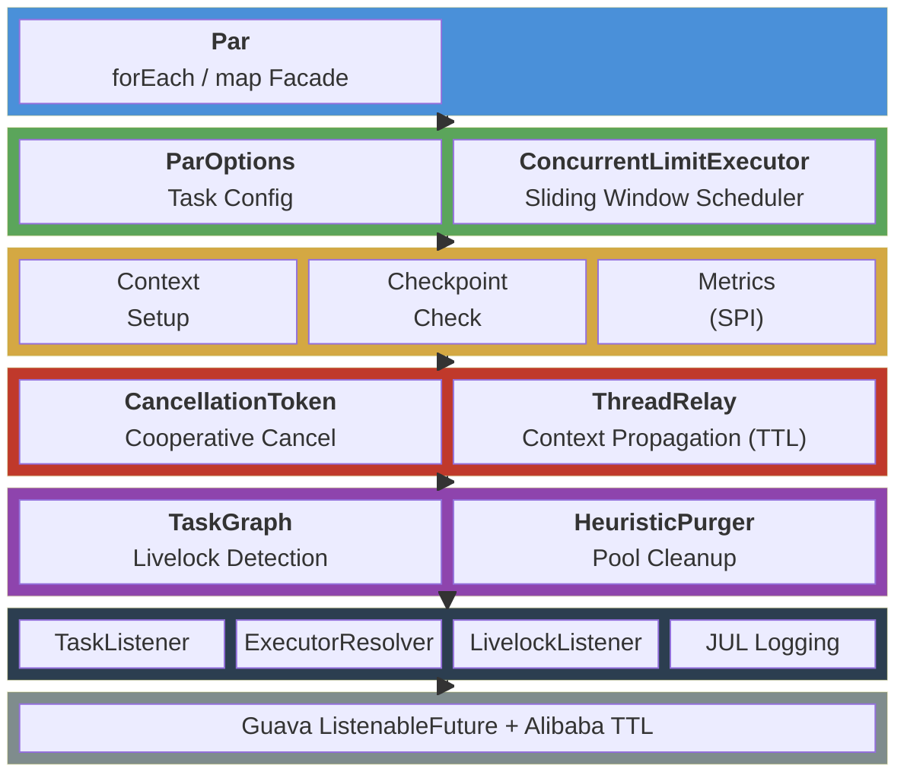

# 🪿 VFormation（雁阵）

> **⚠️ 项目状态：开发中（Pre-release）**
>
> 本项目仍在积极开发中，API 可能会发生变化。欢迎通过 Issue 提交反馈和建议。

🪿 **VFormation**（雁阵）是一个 Java 8+ 结构化并发工具包，将现代结构化并发思想——协作式取消、快速失败、死锁检测、上下文传播——带入 Java 8 生态。🛡️🚀🎯

正如大雁以 V 字阵型分担飞行阻力，雁阵通过协作式取消、快速失败、死锁检测、上下文传播和滑动窗口调度来编排你的并行任务——**失败即止，取消级联，死锁可见**。

---

## 快速开始

大多数场景下，你只需要用 **`Par.map`** 一个方法：

### 1. 添加 Maven 依赖

```xml
<dependency>
    <groupId>io.github.huatalk</groupId>
    <artifactId>vformation</artifactId>
    <version>1.0.0-SNAPSHOT</version>
</dependency>
```

### 2. 初始化（应用启动时执行一次）

```java
ParConfig config = new ParConfig();
Par par = new Par(config);

// 注册线程池
config.registerExecutor("io-pool", Executors.newFixedThreadPool(10));
```

### 3. 使用 `Par.map` 并行处理

```java
ParOptions options = ParOptions.ioTask("fetchData")
    .parallelism(5)
    .timeout(3000)
    .build();

List<String> urls = Arrays.asList("url1", "url2", "url3", "url4", "url5");
AsyncBatchResult<String> result = par.map(
    "io-pool",
    urls,
    url -> httpClient.fetch(url),
    options
);

List<ListenableFuture<String>> futures = result.getResults();
```

以上就是全部。`Par.map` 内部自动处理滑动窗口调度、超时控制、快速失败取消和上下文传播，无需额外配置。

---

## 核心特性

- **🛡️ Cooperative Cancellation** — 父子令牌级联，Late-Binding 避免竞态，轻量异常零堆栈开销
- **⚡ Fail-Fast Only** — 任一子任务失败立即取消同批剩余任务。这是刻意的设计选择：框架只提供 fail-fast 语义，不提供"忽略失败继续执行"模式。如需容错，请在任务内部自行 catch 异常
- **🔍 Deadlock Detection** — DAG 环路检测，覆盖任务级循环依赖和执行器级自环
- **🔗 Context Propagation** — 两级 Map 接力，取消令牌、任务配置自动传播到子线程
- **🚀 Sliding-Window Scheduling** — 完成一个补一个，不淹没线程池
- **🎯 Task-Type-Aware Dispatch** — CPU 密集型拒绝入队防饥饿，IO 密集型正常排队
- **🔌 Pluggable SPI** — TaskListener / ExecutorResolver / LivelockListener

---

## 进阶功能

以下功能按需启用，不影响 `Par.map` 的基本使用。

### 注册监控回调

```java
config.addTaskListener(event -> {
    System.out.printf("Task [%s] completed in %dms (waited %dms in queue)%n",
        event.getTaskName(),
        event.executionTimeMillis(),
        event.waitTimeMillis());

    if (event.getException() != null) {
        System.err.println("Task failed: " + event.getException().getMessage());
    }
});
```

### 活锁检测

```java
// 启用活锁检测
config.setLivelockDetectionEnabled(true);

// 注册活锁监听器
config.addLivelockListener(event -> {
    if (event.hasExecutorSelfLoop()) {
        log.warn("Potential deadlock: executor self-loop detected! {}",
            event.getExecutorEdges());
    }
});

// 提供任务到线程池的映射关系
config.setExecutorResolver(new ExecutorResolver() {
    @Override
    public ThreadPoolExecutor resolveThreadPool(String name) {
        return executorMap.get(name);
    }

    @Override
    public Map<String, String> getTaskToExecutorMapping() {
        return taskToPoolMapping;  // e.g., {"fetchPrice": "io-pool", "calculate": "cpu-pool"}
    }
});

// 在请求入口初始化
TaskGraph.initOnRequest();
try {
    // ... 执行业务逻辑，期间所有 Par 调用会自动记录依赖关系
} finally {
    // 请求结束时自动检测并通知
    TaskGraph.destroyAfterRequest(config);
}
```

### CPU-Bound 任务调度

```java
// CPU 密集型任务：拒绝入队，宁可同步执行也不阻塞工作线程
ParOptions cpuOptions = ParOptions.cpuTask("compute")
    .parallelism(Runtime.getRuntime().availableProcessors())
    .build();

// IO 密集型任务：允许入队等待
ParOptions ioOptions = ParOptions.ioTask("fetchRemote")
    .parallelism(20)
    .timeout(5000)
    .build();
```

### 协作式取消

```java
// 父任务中
CancellationToken parentToken = CancellationToken.create();
CancellationToken childToken = new CancellationToken(parentToken);

// 取消父任务 → 自动级联到子任务
parentToken.cancel(false);
// childToken 状态也会变为 PROPAGATING_CANCELED

// 在子任务代码中设置检查点
Checkpoints.checkpoint("myTask", true);  // 如果已取消，抛出 LeanCancellationException
```

---

## 架构设计



---

## 核心依赖

| 依赖 | 版本 | 用途 |
|------|------|------|
| Guava | 33.2.1-jre | ListenableFuture, FluentFuture, Graph API |
| TransmittableThreadLocal | 2.14.5 | 跨线程上下文传播 |

---

## 构建

```bash
# 编译
mvn clean compile

# 运行测试
mvn test

# 打包
mvn clean package
```

---

## License

Apache License 2.0
