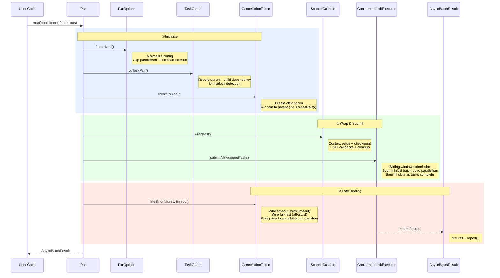

[**中文**](README.md) | **English**

# 🪿 VFormation

> **⚠️ Status: In Development (Pre-release)**
>
> This project is under active development. APIs may change. Feedback and suggestions are welcome via Issues.

🪿 **VFormation** is a structured concurrency toolkit for Java 8+, built around cooperative cancellation, fail-fast behavior, context propagation, deadlock detection, and sliding-window scheduling.  
It targets practical Java 8 pain points: lost cancellation signals, missing `ThreadLocal` context across thread pools, and hard-to-debug deadlocks in nested parallel calls.  
Compared with CompletableFuture chains and traditional `ExecutorService + invokeAll` workflows, VFormation prioritizes structured semantics and operational safety.  
The goal is simple: without upgrading JDK, make concurrent code move from “just works” to **fail immediately, cancel cascadingly, deadlocks visible**.

## Quick Start

In most cases, all you need is a single method: **`Par.map`**.

### 1. Add Maven Dependency

```xml
<dependency>
    <groupId>io.github.huatalk</groupId>
    <artifactId>vformation</artifactId>
    <version>1.0.0</version>
</dependency>
```

### 2. Initialize (once at application startup)

```java
ParConfig config = ParConfig.builder()
    .executor("io-pool", Executors.newFixedThreadPool(10))
    .build();
Par par = new Par(config);
```

### 3. Parallel Processing with `Par.map`

```java
ParOptions options = ParOptions.ioTask("fetchData")
    .parallelism(5)
    .timeout(3000)
    .build();

List<String> urls = Arrays.asList("url1", "url2", "url3", "url4", "url5");
AsyncBatchResult<String> result = par.map(
    "io-pool",
    urls,
    url -> httpClient.fetch(url),
    options
);

List<ListenableFuture<String>> futures = result.getResults();
```

That's it. `Par.map` internally handles sliding-window scheduling, timeout control, fail-fast cancellation, and context propagation — no extra configuration needed.

---

## Core Features

### ⚡ Fail-Fast

**Problem:** In traditional parallel processing, when one subtask fails, the remaining tasks continue to execute, wasting thread and IO resources. The caller still has to wait for all tasks to complete before receiving the error.

**Solution:** When any subtask throws an exception, the framework immediately cancels all remaining tasks in the same batch. This is a deliberate design choice — only fail-fast semantics are provided, with no "ignore failures and continue" mode. If you need fault tolerance, catch exceptions inside your task function.

### 🛡️ Cooperative Cancellation

**Problem:** `Thread.interrupt()` has no effect on code that doesn't check the interrupt flag, and forcibly killing threads may cause resource leaks. In nested parallel calls, cancellation signals cannot automatically propagate downward.

**Solution:** Parent-child tokens cascade automatically — cancelling a parent task cascades to all child tasks. The Late-Binding mechanism wires timeout and fail-fast only after all tasks are submitted, avoiding race conditions. Dual exception strategy — `LeanCancellationException` (no stack trace, zero overhead) for high-frequency scenarios, `FatCancellationException` (full stack trace) for debugging.

### 🔗 Context Propagation

**Problem:** `ThreadLocal` values are lost when tasks are submitted to a thread pool. Request-scoped context (trace IDs, user identity, cancellation tokens) cannot automatically transfer to child threads, forcing developers to pass parameters manually in every task.

**Solution:** Two-level map relay based on Alibaba TTL — the parent thread's `curMap` automatically becomes the child thread's `parentMap`, transparently propagating cancellation tokens, task config, and task names with zero intrusion into business code.

### 🚀 Sliding-Window Scheduling

**Problem:** Submitting all tasks to a thread pool at once causes memory pressure and thread starvation when task volume is high. `invokeAll()` blocks until all tasks complete, making it impossible to retrieve results incrementally.

**Solution:** A "fill one slot as one completes" sliding window — initially submits `parallelism` tasks, then immediately fills one slot as each task completes, keeping the thread pool fully utilized without overflowing.

### 🔌 Pluggable SPI

**Problem:** Hard-coded monitoring and extension points are difficult to adapt to different technology stacks, coupling the framework to business monitoring systems.

**Solution:** Three SPI extension points registered on `ParConfig` with zero hard-coded dependencies:
- **TaskListener** — Task lifecycle callbacks (execution time, queue wait time, exceptions) for integration with any monitoring system
- **ExecutorResolver** — Thread pool name resolution, supporting purge cleanup and deadlock detection
- **LivelockListener** — Deadlock detection event callbacks

### 🔍 Deadlock Detection

**Problem:** When nested parallel calls share the same thread pool, outer tasks hold threads waiting for inner tasks to complete, while inner tasks queue waiting for outer tasks to release threads — a deadlock. Such issues are extremely hard to reproduce and diagnose in production.

**Solution:** A request-scoped DAG automatically records task dependencies. At request end, cycle detection runs covering both task-level circular dependencies and executor-level self-loops, notifying diagnostic results via SPI callbacks.

### 🎯 Task-Type-Aware Dispatch

**Problem:** When CPU-bound and IO-bound tasks share the same queue, a flood of IO tasks can starve CPU tasks, causing computation latency to spike.

**Solution:** CPU-bound tasks' `offer()` returns `false`, triggering the rejection policy (typically `CallerRunsPolicy`) — preferring synchronous execution on the caller thread over blocking worker threads. IO-bound tasks queue normally.

---

## When to Use & Design Boundaries

**Recommended for:** Java 8 parallel batch workloads that need fail-fast behavior, cascading cancellation, context propagation, and better observability.

**Not ideal for:** workflows that require reactive chain orchestration, built-in retry/fault-tolerance policies, or a Spring Boot Starter (intentionally out of scope for now).

To keep the API minimal and semantics consistent, the project maintains an [Idea Graveyard](IdeaGraveyard.md) (inspired by Guava's same practice): a place to document features we seriously evaluated but intentionally decided not to implement (for example configurable failure policies, built-in retry, chained orchestration, and a Spring Boot Starter), together with clear rationale and alternatives. If you plan to submit a feature request, we recommend reading it first to align expectations with the project's design direction.

---

## Advanced Features

The following features can be enabled on demand without affecting basic `Par.map` usage.

### Cooperative Cancellation

```java
// In parent task
CancellationToken parentToken = CancellationToken.create();
CancellationToken childToken = new CancellationToken(parentToken);

// Cancel parent → automatically cascades to child tasks
parentToken.cancel(false);
// childToken state also becomes PROPAGATING_CANCELED

// Set checkpoints in subtask code
Checkpoints.checkpoint("myTask", true);  // Throws LeanCancellationException if cancelled
```

### Monitoring Callbacks

```java
ParConfig config = ParConfig.builder()
    .executor("io-pool", Executors.newFixedThreadPool(10))
    .taskListener(event -> {
        System.out.printf("Task [%s] completed in %dms (waited %dms in queue)%n",
            event.getTaskName(),
            event.executionTimeMillis(),
            event.waitTimeMillis());

        if (event.getException() != null) {
            System.err.println("Task failed: " + event.getException().getMessage());
        }
    })
    .build();
```

### Deadlock Detection

```java
// Build config with deadlock detection enabled
ParConfig config = ParConfig.builder()
    .executor("shared-pool", pool)
    .livelockDetectionEnabled(true)
    .livelockListener(event -> {
        if (event.hasExecutorSelfLoop()) {
            log.warn("Potential deadlock: executor self-loop detected! {}",
                event.getExecutorEdges());
        }
    })
    .executorResolver(new ExecutorResolver() {
        @Override
        public ThreadPoolExecutor resolveThreadPool(String name) {
            return executorMap.get(name);
        }

        @Override
        public Map<String, String> getTaskToExecutorMapping() {
            return taskToPoolMapping;  // e.g., {"fetchPrice": "io-pool", "calculate": "cpu-pool"}
        }
    })
    .build();

// Initialize at request entry
TaskGraph.initOnRequest();
try {
    // ... execute business logic; all Par calls automatically record dependencies
} finally {
    // Detect and notify at request end
    TaskGraph.destroyAfterRequest(config);
}
```

### CPU-Bound Task Scheduling

```java
// CPU-bound: reject queueing, prefer synchronous execution over blocking worker threads
ParOptions cpuOptions = ParOptions.cpuTask("compute")
    .parallelism(Runtime.getRuntime().availableProcessors())
    .build();

// IO-bound: queue normally
ParOptions ioOptions = ParOptions.ioTask("fetchRemote")
    .parallelism(20)
    .timeout(5000)
    .build();
```

---

## Execution Flow



---

## Dependencies

| Dependency | Version | Purpose |
|---|---|---|
| Guava | 33.2.1-jre | ListenableFuture, FluentFuture, Graph API |
| TransmittableThreadLocal | 2.14.5 | Cross-thread context propagation |

---

## Compatibility

| Item | Notes |
|---|---|
| JDK | Java 8+ (`maven.compiler.source/target = 1.8`) |
| Build Tool | Maven 3.x (recommended) |
| Core Modules | `vformation` (library), `vformation-demo` (sample project) |

---

## Build

```bash
# Compile
mvn clean compile

# Run tests
mvn test

# Package
mvn clean package
```

---

## License

Apache License 2.0
